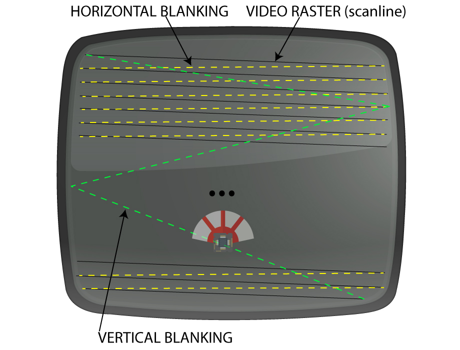
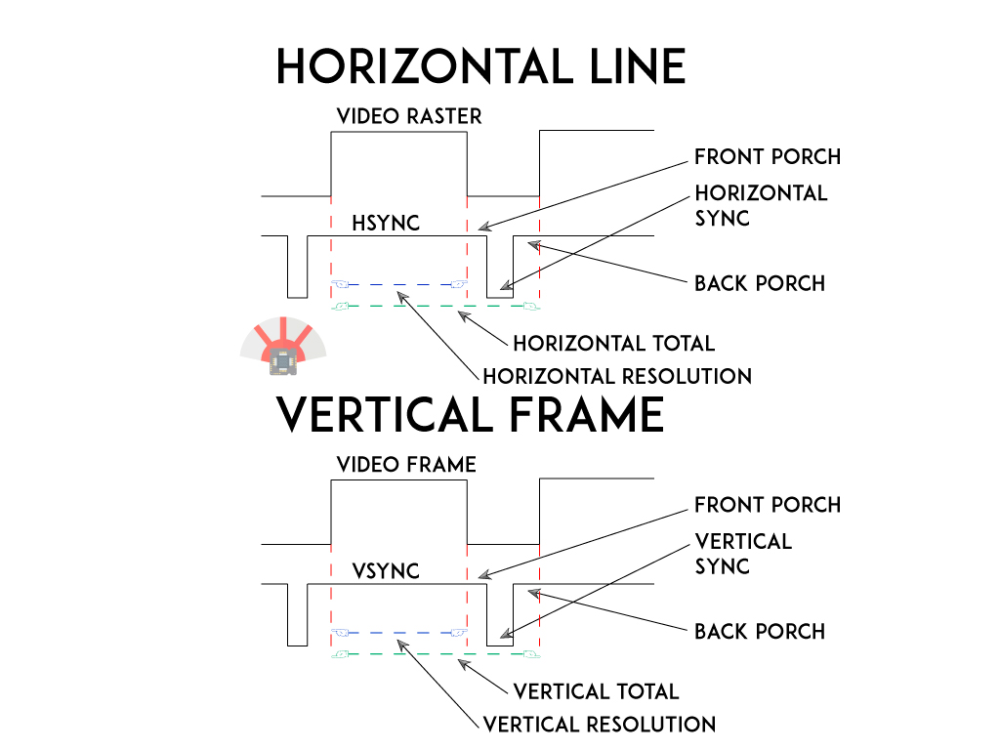
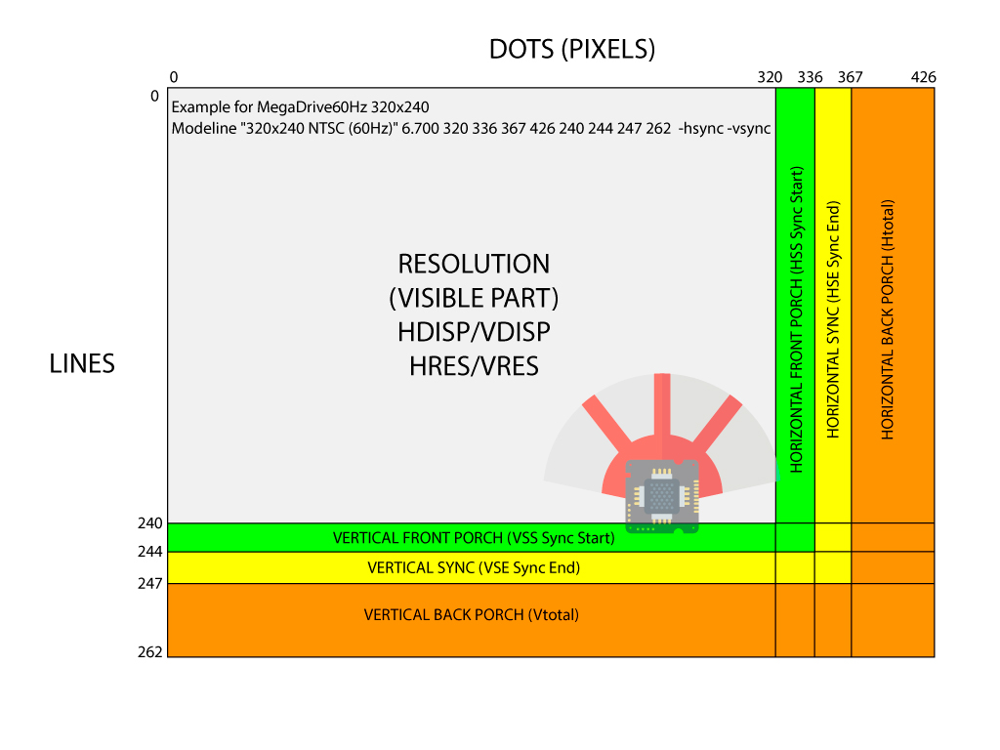
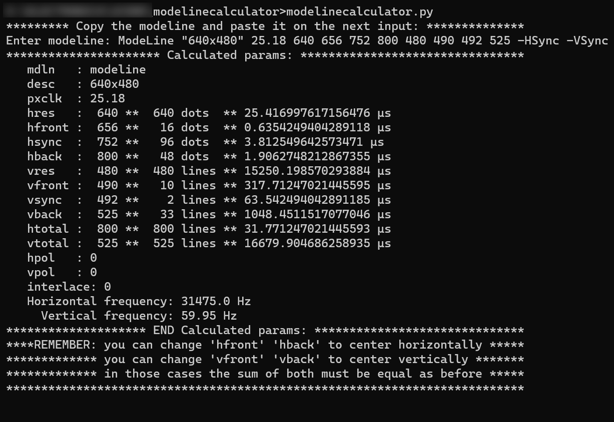

# Modelines: dot, line and period/timings calculator

## Table of contents

- [What's this?](#whats-this)
- [How the analog TV works](#how-the-analog-tv-works)
- [Modelines](#modelines)
- [Installation](#installation)
- [How to use](#how-to-use)

What's this? 
============

## This is a little python script to calculate modeline details
This is a simple script useful to calculate the right timings
dots (pixels), lines and the timings for each of the required 
parameters to drive a mcu or FPGa with accurate timing.

No interlaced calculations are included right now on the script.

This script was done as example in a livestream so little time
was spent, you can improve it all you want, it's free.

## Why
Sometimes we need to create perfect resolutions for a console
an arcade board, etc.. that's when this script is handy.
It will calculate the timings for the interrupts, timers, counters
and all the values required to generate the right sync.

This script is explained during an event here:
Twitch https://www.twitch.tv/kabukiflux

# How the analog TV works



The analog TV uses the sync pulses to generate the raster, 
the raster is the visible dots and lines on the screen.
Once the visible part is drawn on the screen it needs the 
blanking times to retrace the dot into the new position.

## Sync



The Sync pulses are required to indicate the end of a line
and the end of a frame to retrace the dot.
The Sync is Horizontal for the lines and Vertical for the frames.

The blanking time has more than the sync itself, it has the
Front Porch (time after the video ended and the sync begins) and
the Back Porch (time after the sync ends and the video begins).

# Modelines

The modeline is a direct representation of the resolution used on
some devices to be shown on screen. It contains all the data required
for the raster zone and the timings required for the blanking and sync.

The modelines are like this:

```
Modeline "320x240 NTSC (60Hz)" 6.700 320 336 367 426 240 244 247 262  -hsync -vsync
Modeline "384x240 NTSC (60Hz)" 8.040 384 403 440 511 240 244 247 262  -hsync -vsync 

modeline "496x384" 15,4752 496 508 570 620 384 386 391 416 -hsync -vsync
modeline '512x384' 14,75 512 520 568 600 384 388 391 410 -hsync -vsync
Modeline "512x384_60,0Hz 25,0KHz" 15.575 512 520 582 624 384 385 390 416  -hsync -vsync

ModeLine "640x480" 25.20 640 656 752 800 480 490 492 525 -HSync -VSync
ModeLine "640x480" 25.18 640 656 752 800 480 490 492 525 -HSync -VSync
ModeLine "640x480" 25.17 640 656 752 800 480 490 492 525 -HSync -VSync 
```

## How is the inside of a modeline 



This image shows a representation of the modeline converted into the
analog parameters, the modeline structure is usually:

```
Modeline syntax: pixelclock hres hsyncstart hsyncend htotal vres vsyncstart vsyncend vtotal [flags]
Flags (optional): +HSync, -HSync, +VSync, -VSync, Interlace, DoubleScan, CSync, +CSync, -CSync
```


# Installation
You need to have Python installed, nothing more.

# How to use
Easy, execute
````commandline
modelinecalculator.py
````

when prompted paste a modeline.



## Some nice resources

[Vga2RGB calculator](https://www.epanorama.net/faq/vga2rgb/calc.html)

[Modeline database](https://www.mythtv.org/wiki/Modeline_Database)

[VGA timing](http://tinyvga.com/vga-timing)

[SailorSat modelines](https://github.com/SailorSat/soft-15khz/blob/master/docs/modelines.txt)

[WinModelines](http://www.geocities.ws/podernixie/htpc/modes-en.html)

[Easy MAME monitor info](https://easymamecab.mameworld.info/html/monito13.htm)

I'm not responsible
============
And yes, read below, no responsability taken on bad use.

DISCLAIMER (MIT Licensing)
==========================
Permission to use, copy, modify, and distribute this software for any
purpose with or without fee is hereby granted, provided that the above
copyright notice and this permission notice appear in all copies.

The software is provided "as is" and the author disclaims all warranties
with regard to this software including all implied warranties of
merchantability and fitness. In no event shall the author be liable for
any special, direct, indirect, or consequential damages or any damages
whatsoever resulting from loss of use, data or profits, whether in an
action of contract, negligence or other tortious action, arising out of
or in connection with the use or performance of this software.
